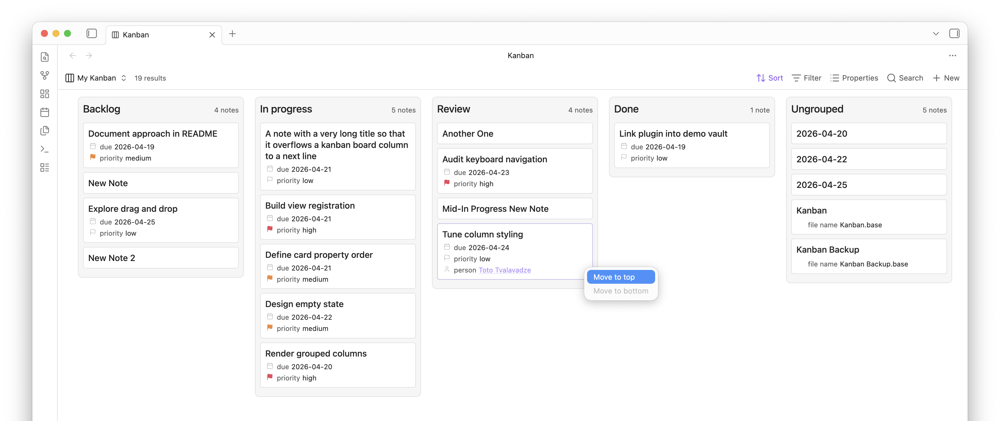

# Bases Kanban View

A minimal kanban layout for Obsidian Bases.

## Features

- A custom `Kanban` Bases view
- Columns derived from the active Bases grouping (see note 1 below)
- Cards that render the note title plus the properties already selected in Bases
- Drag-and-drop column reordering
- Drag-and-drop card reordering within a column
- Cross-column card moves when the board is grouped by a writable `note.*` property
- Persisted column order per grouping
- Persisted manual card order per grouping (see note 2 below)
- A small view option to hide empty properties on cards

## Design goals

- Reuse the existing Sort, Group, Filter, and Properties controls instead of introducing separate kanban settings
- Keep the styling minimal so the view feels like part of Bases rather than a themed plugin
- Prefer pragmatic UX decisions over ornamentation or broad customization
- Keep interactions fast and predictable (fast updates, no jumping DOM, etc.)

---

## Notes

### 1. Note on `rawKanbanView` and runtime API

I wanted column reordering to respect the built-in Bases `groupBy` UI instead of adding a second grouping selector in plugin settings. Another selector would create a second source of truth for the same concept, which felt confusing and easy to desync from the active Base view.

In practice, the public `BasesViewConfig` surface exposed the active sort state but did not expose the current built-in `groupBy` selection in a usable way for this feature, and I could not find a documented public accessor for it. To keep the UI aligned with the actual active Bases view, the plugin reads the active kanban view's runtime `query.views` entry through `rawKanbanView`.

This is an intentional tradeoff: it uses observed runtime shape because the documented public API did not appear to expose the active `groupBy`, but it avoids introducing duplicate settings and keeps column ordering scoped to the grouping the user actually picked in Bases.

### 2. Note on ordering behavior

Card ordering has two "modes" (not a user facing term), automatic and manual.

In automatic mode, the board simply follows the active Bases sort. If the user chooses a sort from the Obsidian Bases UI, the cards should appear in that order and no manual card arrangement is treated as active.

In manual mode, the user has started rearranging cards directly. At that point, the board behaves like a fixed snapshot of the current grouped board rather than continuing to follow the live Bases sort for card order.

Manual mode is reset as soon as the user changes the Bases sort again.

---

## Future work

- Formula support for properties
- Better keyboard navigation, including moving cards and focus mode (like Things for Mac)
- Richer context menus for moving cards, opening notes, and similar actions
- Better handling for date-typed properties, including daily note awareness and interaction
- Smarter property type detection and cleaner formatting, ideally configurable from the view
- Proper mobile validation; I have not tested it thoroughly yet, although `this.app.emulateMobile(true);` suggests the basic layout should be workable

---

## On Usage of AI Agents

- Most (90%+) of the code in this repo was written with OpenAI Codex 5.4 in the Codex app
- This has been my normal way of programming since early 2025: I use the model for implementation, but I do the thinking, puzzle-solving, review, and editing as my responsibility
- I see my value in choosing the approach, shaping the solution, reviewing the output, and rewriting parts that do not hold up
- I lean heavily on git in that workflow, and I do not let agents commit without my review or an explicit instruction from me
